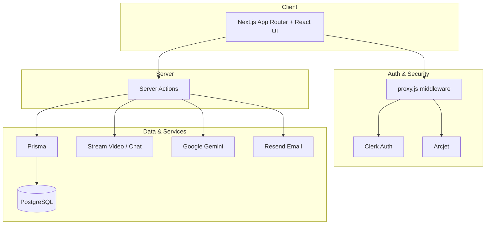

# Prept

**AI-powered interview marketplace** — book mock interviews with real interviewers, run live video sessions, get structured feedback, and manage credits & payouts.

Made with ❤️ by **Ayush** · [@ayushsinha008](https://github.com/ayushsinha008)

---

## Recipe

### Application type

| Field | Value |
| --- | --- |
| **Name** | Prept |
| **Type** | Full-stack SaaS web application |
| **Domain** | Interview prep marketplace (two-sided: interviewees ↔ interviewers) |
| **Author** | Ayush |

### Ingredients (tech stack)

| Layer | Choice |
| --- | --- |
| Framework | Next.js 16 (App Router) |
| UI | React 19, Tailwind CSS 4, shadcn/ui, Motion |
| Auth | Clerk |
| Database | PostgreSQL + Prisma 7 |
| Video & chat | Stream Video / Stream Chat |
| AI | Google Gemini (`@google/generative-ai`) |
| Email | Resend + React Email |
| Security | Arcjet (bot protection, rate limits) |
| Payments UX | Clerk Checkout (credits) |

### What you get (features)

1. **Role onboarding** — join as interviewee or interviewer  
2. **Explore & book** — browse interviewers, pick availability slots  
3. **Live calls** — Stream-powered video interview rooms  
4. **AI questions** — Gemini-assisted question generation during sessions  
5. **Feedback** — structured post-session reviews  
6. **Credits & payouts** — credit balance, withdrawals, admin review flow  
7. **Dashboard** — interviewer availability, earnings, appointments  

### Architecture (at a glance)



```text
Browser (Next.js App Router)
    │
    ├── Clerk auth + middleware (proxy.js)
    ├── Server Actions (actions/*)
    ├── Prisma → PostgreSQL
    ├── Stream (video tokens / webhooks)
    ├── Gemini (AI questions / summaries)
    └── Resend (transactional email)
```

---

## Setup

### 1. Clone

```bash
git clone https://github.com/ayushsinha008/ai-interviewer-marketplace.git
cd ai-interviewer-marketplace
npm install
```

### 2. Environment

Create `.env.local`:

```env
# App
NEXT_PUBLIC_APP_URL=http://localhost:3000

# Clerk
NEXT_PUBLIC_CLERK_PUBLISHABLE_KEY=
CLERK_SECRET_KEY=

# Database (Supabase / any Postgres)
DATABASE_URL=
DIRECT_URL=

# Stream
NEXT_PUBLIC_STREAM_API_KEY=
STREAM_SECRET_KEY=

# AI
GEMINI_API_KEY=

# Email
RESEND_API_KEY=
ADMIN_EMAIL=

# Security / admin
ARCJET_KEY=
ADMIN_PAYOUT_PASSWORD=
```

### 3. Database

```bash
npx prisma migrate dev
# optional sample feedback seed (edit BOOKING_ID in prisma/seed.js first)
npx prisma db seed
```

### 4. Run

```bash
npm run dev
```

Open [http://localhost:3000](http://localhost:3000).

---

## Project structure

```text
app/           # routes (landing, auth, explore, call, dashboard, …)
actions/       # server actions (booking, call, dashboard, AI, …)
components/    # shared UI
emails/        # Resend templates
lib/           # prisma, arcjet, helpers
prisma/        # schema + migrations
public/        # static assets
```

---

## Scripts

| Command | Purpose |
| --- | --- |
| `npm run dev` | Local development |
| `npm run build` | Production build |
| `npm run start` | Start production server |
| `npm run lint` | ESLint |

---

## License

Private project by Ayush. All rights reserved unless otherwise noted.
